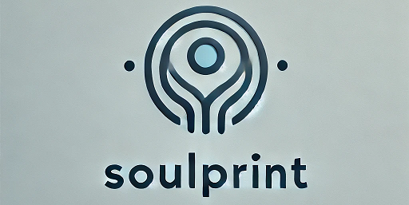

# Soulprint 

Soulprint aims to build the most accurate model of You through conversation. It begins with 10 base categories which will explore your experiences, memories, goals, and aspirations to create a comprehensive understanding of who you are.

## Project Overview

Soulprint engages users in a dynamic conversation, presenting thought-provoking questions and using the responses to generate follow-up topics for future exploration. This iterative process allows for a deep and evolving understanding of the user's personality, values, and life story.

**Note:** Soulprint is currently a hobby project in early development.

## Features
- Dynamic question generation based on user responses
- Follow-up topic suggestions for future conversations
- React frontend with shadcn/ui components
- Flask backend for API handling
- Mistral-large as the LLM (own API key required)

## Tech Stack

- Frontend: React with shadcn/ui components
- Backend: Flask
- AI Model: Mistral AI

## Installation

### Prerequisites

- Node.js and npm
- Python 3.7+
- pip

### Setup

1. Clone the repository:
   ```
   git clone https://github.com/yourusername/soulprint.git
   cd soulprint
   ```

2. Set up the backend:
   ```
   cd backend
   pip install -r requirements.txt
   ```

3. Set up the frontend:
   ```
   cd ../frontend
   npm install
   ```

## Running the Application

1. Start the Flask backend:
   ```
   cd backend
   python app.py
   ```

2. In a new terminal, start the React frontend development server:
   ```
   cd frontend
   npm start
   ```

3. Open your browser and navigate to `http://localhost:3000` to use the application.

## Contact

Maciej Garbacz - [maciejgarbacz7@gmail.com]

Happy soul-searching with Soulprint!
